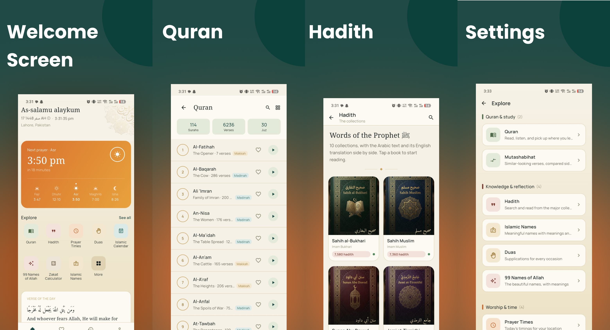

# Deen Companion: Quran & Athan

A free, ad-free companion app for daily Islamic worship — Quran, Hadith, Duas, Prayer Times, Qibla Direction, the Hijri Calendar, and a Zakat Calculator, all in one place.

The app is built with Flutter, with a small amount of native Android (Kotlin) code where the platform genuinely requires it — reliable prayer reminders and an accurate Qibla compass.

---

## Features

- 📖 Full Quran with translation, transliteration, audio recitation, and a dedicated Juz reader.
- 📚 Hadith collections with authenticity grading and an immersive reading experience.
- 🤲 Daily Duas organized by category.
- 🕌 Accurate Prayer Times with multiple calculation methods.
- 🧭 Live Qibla compass with magnetic declination correction.
- 🗓️ Islamic (Hijri) Calendar with regional date adjustment.
- 🪙 Zakat Calculator.
- ✨ Asma-ul-Husna (99 Names of Allah).
- 👶 Islamic Names directory.
- ❤️ Favorites and Recent Activity stored locally on the device.

---

## Why some of this is native

Most of the application is built entirely in Flutter.

Native Android code is used only where the operating system provides functionality that cannot be reliably achieved from Dart alone.

### Prayer Reminders

Prayer reminders are scheduled through Android's `AlarmManager`, allowing alarms to continue working even if the application has been closed or the device has restarted.

### Accurate Qibla Direction

The Qibla API provides the direction relative to **true north**, while device compass sensors report **magnetic north**.

The application uses Android's `GeomagneticField` API to calculate the local magnetic declination so the compass aligns correctly with the true Qibla direction.

Sensor accuracy is also monitored, and the application prompts users to recalibrate the compass whenever unreliable readings are detected.

---

## Tech Stack

- Flutter
- Riverpod
- go_router
- Dio
- Hive
- Kotlin (Android platform integrations)

---

## Architecture

Each feature follows a Clean Architecture structure:

```text
feature/
├── domain/
├── data/
└── presentation/
```

Shared reading preferences are reused across Quran and Hadith readers, while a cache-first strategy keeps commonly accessed content available offline and refreshes it automatically when newer data becomes available.

---

## App Icon

The application launcher icon is generated from:

```
assets/images/app_logo.png
```

using `flutter_launcher_icons`.

---

## Privacy

- No advertisements
- No analytics or tracking SDKs
- No user accounts
- No personal data stored on external servers

Location is used only for features that require it, including Prayer Times, Qibla Direction, and regional Hijri date adjustment.

---

## License

This project is licensed under the MIT License.