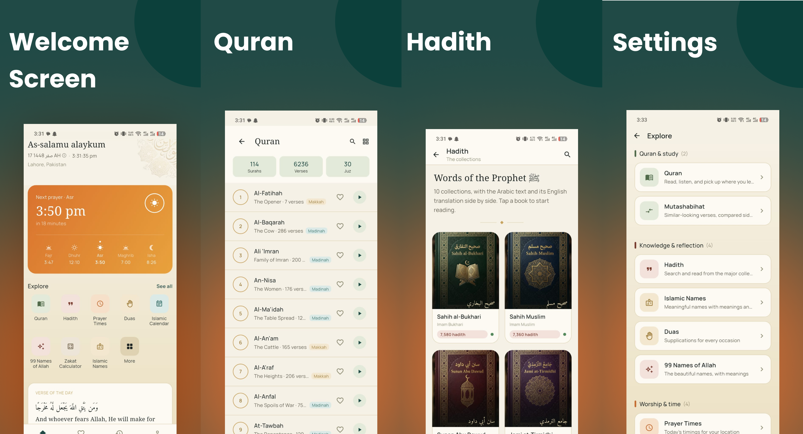

# Deen Companion: Quran & Athan

A companion app for daily Islamic worship: Quran with audio recitation, prayer times with native Android reminders, Qibla, Hadith, Duas, Asma-ul-Husna, Islamic names, the Hijri calendar and a Zakat calculator, in one place.

Built with **Flutter** and **Riverpod** on a feature-first **Clean Architecture**, with a small amount of native **Kotlin** where Android offers something Dart cannot do reliably (exact alarms, Do Not Disturb, magnetic declination for the compass).

> **Status:** the app is a ground-up revamp of an existing production release. Some backends (authentication, groups sync, parts of the daily-content feed) are still being integrated; those layers are implemented behind repository interfaces so the UI and tests are already in place. See [Roadmap](#roadmap).

---

## Table of contents

- [Features](#features)
- [Tech stack](#tech-stack)
- [Architecture](#architecture)
- [Project structure](#project-structure)
- [Native Android integrations](#native-android-integrations)
- [Offline behaviour & local storage](#offline-behaviour--local-storage)
- [Getting started](#getting-started)
- [Configuration & secrets](#configuration--secrets)
- [Running the app](#running-the-app)
- [Testing](#testing)
- [Development guidelines](#development-guidelines)
- [Supported platforms](#supported-platforms)
- [Roadmap](#roadmap)
- [License](#license)

---

## Features

| Area | What it does |
| --- | --- |
| **Quran** | Surah list, translation and transliteration, search, last-read tracking, reader preferences shared with Hadith, and a dedicated **Juz** hub and reader. |
| **Quran audio & reciters** | Streaming recitation by surah with multiple reciters, mini player and full-screen player, background playback and media-session controls (`just_audio` + `just_audio_background`). |
| **Prayer times** | Times for the user's location with selectable calculation method and Asr juristic setting, a monthly calendar and an upcoming-days view. |
| **Prayer reminders** | Per-prayer reminders delivered as native Android alarms with a full-screen alarm UI, snooze and dismiss, that survive app kill and reboot. |
| **Prayer Do Not Disturb** | Optionally silences the phone for a configurable window around each prayer (preset, custom or per-prayer durations). |
| **Notifications** | Daily Ayat & Hadith notification scheduled locally; reliability prompts that guide users through battery/exact-alarm settings on aggressive OEMs. |
| **Qibla** | Live compass using true-north bearing corrected with the device's magnetic declination, with sensor-accuracy and recalibration prompts. |
| **Hadith** | Major collections, reading mode, search, grading and a Hadith of the day. |
| **Duas** | Categorised duas with a reader, search and favourites. |
| **Asma-ul-Husna** | The 99 names with meanings, search, detail pages and a daily practice. |
| **Islamic names** | Boy/girl name directory with origin filters and detail pages. |
| **Mutashabihat** | Compare similar verses across surahs with highlighted differences. |
| **Islamic calendar** | Hijri calendar, events, Gregorian ↔ Hijri converter, and regional day adjustment. |
| **Zakat** | Wealth and agriculture calculators with a result breakdown. |
| **Groups** | Create study groups with privacy options and track group streaks (local-first; sync pending). |
| **Explore** | One grid that surfaces every feature, plus Favorites and Recent Activity. |
| **Authentication** | Welcome, login, sign-up, OTP and forgot-password flows with persisted session/guest gate. The repository is currently a stub that returns `NotImplementedFailure` until the backend is wired in. |
| **Personalisation** | Light/Dark theme, adjustable reading preferences and a reduced-motion-aware animation system. |

---

## Tech stack

| Concern | Choice |
| --- | --- |
| Framework | Flutter `3.47` (stable), Dart `^3.11.5` |
| State management & DI | `flutter_riverpod` (providers, `Notifier`/`AsyncNotifier`, `ProviderContainer` overrides in tests) |
| Navigation | `go_router` with a shell route for the bottom navigation |
| Networking | `dio` with interceptors (API key, logging), `connectivity_plus` |
| Local storage | `hive` / `hive_flutter` (preferences + response cache), `flutter_secure_storage` |
| Audio | `just_audio`, `just_audio_background` |
| Location & sensors | `geolocator`, `geocoding`, `flutter_compass`, `permission_handler` |
| Notifications | Native Android `AlarmManager` (prayer alarms) and `flutter_local_notifications` + `timezone` (daily content) |
| UI | `flutter_screenutil`, `flutter_animate`, `flutter_svg`, `google_fonts`, `shimmer` |
| Ads | `google_mobile_ads` (configured per build; disabled when no IDs are supplied) |
| Testing | `flutter_test`, `mocktail` |

External data comes from [UmmahAPI](https://ummahapi.com) and the [Aladhan](https://aladhan.com/prayer-times-api) prayer-times API.

---

## Architecture

The code is organised **by feature**, and each feature follows **Clean Architecture** with a strict dependency direction:

```
presentation  ──▶  domain  ◀──  data
 (widgets,         (entities,    (models, DTO ↔ entity mapping,
  Riverpod          repository    remote/local datasources,
  providers)        contracts,    repository implementations)
                    use cases)
```

- **Domain** is pure Dart: entities, repository interfaces and business rules (e.g. DND window planning, daily content selection, reminder preferences). It depends on nothing else, which makes it trivial to unit test.
- **Data** implements the repository contracts. Datasources talk to Dio or Hive; models parse JSON and map to entities; repositories translate exceptions into typed `Failure`s.
- **Presentation** holds screens, widgets and Riverpod providers/controllers. Widgets never touch Dio or Hive directly.
- **Errors as values:** repositories return a lightweight `Result`/`Failure` pair (`ServerFailure`, `NetworkFailure`, `CacheFailure`, `NotFoundFailure`, `NotImplementedFailure`, …) instead of throwing across layers.
- **Dependency injection** is Riverpod: infrastructure providers live in `core/di`, feature providers next to the feature, and tests override them with fakes.
- **Cache-first reads:** a generic `CacheFirstStreamNotifier` serves cached data immediately and refreshes it from the network in the background.
- **Reusable UI/motion:** shared hero, ornament and badge widgets in `shared/`, and a `MotionScope`/`MotionLevel` system in `core/motion` so all animation honours reduced-motion settings.

### Architecture principles

1. Dependencies point inward; `domain` imports nothing from `data` or `presentation`.
2. One feature = one folder; features don't import each other's internals (shared code goes to `shared/` or `core/`).
3. Side effects (network, storage, platform channels) sit behind interfaces so they can be faked.
4. Business rules live in plain Dart classes, not in widgets.
5. No secrets in source: keys and IDs are injected at build time.

---

## Project structure

```
lib/
├── main.dart / main_dev.dart / main_prod.dart   # flavor entry points
├── bootstrap.dart                               # storage, ads, notifications, DND sync
├── app.dart                                     # MaterialApp.router, theme, motion scope
├── core/
│   ├── cache/  config/  constants/  di/  error/  location/
│   ├── motion/  network/  permissions/  router/  storage/
│   ├── theme/  usecase/  utils/  widgets/
├── shared/                                      # cross-feature domain, providers, widgets
└── features/
    ├── quran/  audio_player/  prayer_times/  prayer_reminders/  prayer_dnd/
    ├── qibla/  hadith/  duas/  asma_ul_husna/  islamic_names/  mutashabihat/
    ├── islamic_calendar/  zakat/  daily_content/  reliability_setup/
    ├── auth/  groups/  favorites/  recent_activity/  home/  explore/
    ├── profile/  splash/  ads/
    └── <feature>/{domain,data,presentation}

android/app/src/main/kotlin/.../app/
├── alarm/   # exact prayer alarms, foreground service, full-screen alarm UI
├── dnd/     # Do Not Disturb scheduling and notification-policy control
└── qibla/   # magnetic declination

test/                                            # mirrors lib/ one-to-one
```

---

## Native Android integrations

Most of the app is plain Flutter. Native Kotlin is used only where Dart cannot meet the requirement:

- **Prayer alarms:** scheduled with `AlarmManager` exact alarms, played from a foreground service and shown through a full-screen activity. A WorkManager sync and boot receivers re-arm them after reboot, app update or time change. Flutter talks to this over a method channel.
- **Prayer Do Not Disturb:** exact start/end alarms and `NotificationManager` policy control, re-armed on boot/time/timezone change.
- **Qibla accuracy:** the API gives a bearing relative to *true* north while sensors report *magnetic* north; `GeomagneticField` supplies the local declination to reconcile them.
- **Daily content notifications** use `flutter_local_notifications`; the status-bar icon is a monochrome silhouette of the logo, as Android requires.

---

## Offline behaviour & local storage

- Quran, Hadith, names and other API content is cached in Hive (`api_cache_box`) and served **cache-first**, then refreshed when online.
- User state (favourites, recent activity, reader and theme preferences, reminder/DND settings, last-read position, auth gate) is stored locally.
- Prayer alarms, DND windows and daily notifications are scheduled on-device and fire without a network connection.
- Audio streams over the network; there is no offline audio download yet.

---

## Getting started

### Prerequisites

- Flutter `3.47.x` (Dart `^3.11.5`) — check with `flutter --version`
- Android Studio / Android SDK (JDK 17) for Android; Xcode + CocoaPods for iOS
- An [UmmahAPI](https://ummahapi.com) key for live content

### Setup

```bash
git clone https://github.com/alee155/deen-companion.git
cd deen-companion
flutter pub get
```

A fresh clone builds in **debug without any private files**: ads fall back to Google's public test IDs and release signing is skipped.

---

## Configuration & secrets

No credentials are committed. Everything sensitive is injected at build time or lives in git-ignored files. See `.gitignore` for the full list (keystores, `key.properties`, Firebase/Play credentials, `.env*`, local config).

| What | How it is provided | Template |
| --- | --- | --- |
| UmmahAPI key, production ad unit IDs | `--dart-define-from-file=config/prod.json` (git-ignored) | `config/prod.example.json` |
| AdMob application ID | `android/admob.properties` (git-ignored); defaults to Google's sample ID | `android/admob.properties.example` |
| Release signing | `android/key.properties` (git-ignored) | `android/key.properties.example` |

```bash
cp config/prod.example.json config/prod.json                    # then fill in values
cp android/admob.properties.example android/admob.properties    # optional
cp android/key.properties.example android/key.properties        # release builds only
```

Without production ad unit IDs, release builds simply disable ads.

---

## Running the app

```bash
# Development (logging on, test ads)
flutter run -t lib/main_dev.dart --dart-define-from-file=config/prod.json

# Production-flavored run
flutter run -t lib/main_prod.dart --release --dart-define-from-file=config/prod.json

# Release bundle (requires android/key.properties)
flutter build appbundle -t lib/main_prod.dart --dart-define-from-file=config/prod.json
```

Regenerate launcher icons after changing `assets/images/deen_comp.png`:

```bash
dart run flutter_launcher_icons
```

---

## Testing

Tests live under `test/` and mirror the structure of `lib/`.

```bash
flutter test                      # run everything
flutter test test/features/prayer_times    # one feature
flutter test --coverage           # writes coverage/lcov.info
flutter analyze
```

Strategy:

- **Unit tests first**, focused on non-UI logic: entities and value rules, JSON parsing and model↔entity mapping (including malformed/missing fields), repositories (datasources mocked with `mocktail`), use cases, validators, calculation logic (prayer windows, Hijri, Qibla, Zakat), cache and storage behaviour (real Hive in a temp directory), and Riverpod providers/controllers via `ProviderContainer` overrides.
- Each test asserts behaviour, edge cases and failure paths rather than just exercising code for coverage.
- Platform-channel and plugin wrappers are kept thin and behind interfaces so the logic around them stays testable.

---

## Development guidelines

- Follow the feature layout (`domain` / `data` / `presentation`) and keep dependencies pointing inward.
- Put business rules in domain classes with unit tests; keep widgets thin.
- Return typed `Failure`s from repositories; never leak `DioException` or Hive errors to the UI.
- Add tests alongside every logic change; mirror the `lib/` path under `test/`.
- Run `flutter analyze` and `flutter test` before committing.
- Use [Conventional Commits](https://www.conventionalcommits.org/) (`feat(quran): …`, `fix(prayer-times): …`, `chore(android): …`) with one logical change per commit.
- Never commit secrets, keystores or Firebase/Play credentials; use the templates in [Configuration & secrets](#configuration--secrets).

---

## Supported platforms

| Platform | Status |
| --- | --- |
| Android | Primary target, including native alarms and DND |
| iOS (15+) | Builds; native prayer alarm and DND features are Android-only, ads disabled in release |
| Web / desktop | Not supported |

---

## Roadmap

- Wire up the authentication backend and sync groups/streaks.
- Finish the remaining API integrations for daily content.
- Offline audio downloads for Quran recitations.
- iOS parity for prayer reminders (local notifications).
- Widget tests and integration tests for key flows.
- Localisation beyond English.

---

## License

MIT License.
